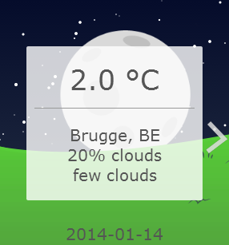

Weather forecast
==================

This code includes a working weather forecast webpage (`weatherreport.html`) with a minimum recommended resolution of 320x240. The webpage can easily be embedded into another webpage using an `iframe`. We decided to do it this way as it's one of the easiest ways for end-users to implement your code.

An example on how to implement this in your website:

    <iframe src=weatherreport.html width=320px height=240px style="border:none;">
    
The weather forecast can easily scale up to big resolutions and still looks good when it would for example get resized. If wanted you can also change certain variables at the start of the weather.js file to change the amount of clouds rendered, etc. With some editing it's also possible to make smaller versions of the forecast page as well. For better performance, the minified version of the javascript is being used.

Screenshot
----------

Information sources
-------------------
Google Maps API (https://developers.google.com/maps)  
freegeoip.net (http://freegeoip.net/)  
Open Weather Map API (http://openweathermap.org/API)

Coders
------
Matthieu Calie  
Maarten Vermue
